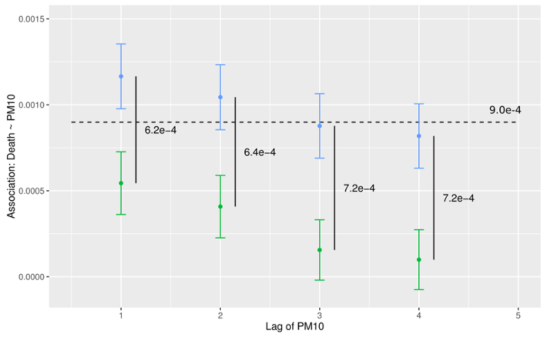

## The Problem {.fullslide}
<center>


## Mechanism

- Ambient exposure triggers physiological symptoms
 - Morbidity (hospitalizations, health conditions) and Mortality (premature death due to physiological causes)
- Not just extreme events: there appears to be no "safe" lower limit
- Air pollution $\longrightarrow$ public health

## General form of single-lag model

The traditional approach in the field uses a log-linear Generalized
Additive Model to obtain the estimated pollution log-relative-rate $\beta$ for
pollutant $\mathbf{x}$, 

$$\begin{split}
\log (\mu) &= \beta \mathbf{x} + \gamma_1 \text{DOW} + S_1 (\text{time},7/\text{year}) \\
&+ S_2(\text{temp},3) + \cdots \\
\end{split}
$$
with various confounding terms such as temperature (mean daily), day-of-week (DOW, as factor), 
and time. In R using the **gam** package, we might estimate such a model via
```{r, eval = FALSE}
mod <- gam(y ~ x + dow + ns(time, df = 7) + ns(temp, df = 3), family = poisson, 
           data = my_data)
```

## However ...

<par><center>
### Is there any reason for the predictor and response to be associated at one integer lag?

## Distributed Lag

A second common approach to modeling the population health impacts of air pollution
uses **distributed-lag**, **distributed-lag non-linear**, or even **distributed-lag non-linear penalized** models  to estimate association over multiple lags. 

Simple distributed lag model:
$$
y_t = a + w_o x_t + w_1 x_{t-1} + \cdots + w_n x_{t-n} + \epsilon_t.
$$

Distributed-lag non-linear model:
$$
y_t = \mathbf{w}_{t\cdot}^T \mathbf{\eta} + \epsilon_t.
$$
and so on for penalization. Typically, we would embed one or more DLNM (penalized or not) components into the single-lag, single-pollutant GAM or GLM framework. 

## Constraints

- The approach is coarse, with resolution of one day at best, 
due to health data recording constraints
- Multicollinearity forces the placing of some predetermined structure upon the lags
- Model selection within the framework remains somewhat of an open question, although good results appear to arise from using AIC selection

## Some time series review

Given a time series $x_t$, indexed by time:

  - Take the Fourier transform $S_x(f)$, a complex function of frequency, then ...
  - the complex amplitude of this is the **spectrum** (**spectral density**)
  - the complex argument is the **phase**

Given two series $x_t, y_t$, we can also estimate the **cross-spectral density**,
which again has two components: the amplitude (spectrum) and phase. 

<par><center>
Remember: the spectrum is a **sinusoidal** decomposition of power.

<!--
## Example of sinusoid phase

<center>

-->

## Toronto, Ontario: 1984-2012 {.fullslide}

<center>


## Synthetic lag

A **portion** of the association obtained by the fitting of the residual effective
predictor and response, after accounting for other confounders and the smooth function
of time, is actually driven by ***coherence between short timescale line components***
present in both the predictor and response.

<par><center>
This opens the door to a different formulation.

## Synthetic lag, continued

Instead of considering the association as point regression on discrete, day-sized chunks of
data, or constrained sets of the same (e.g., DLNM), consider instead a **continuous** relationship between the predictor (health effect) and 
response (air pollutant). The data consists of:

- Daily counts of health effect occurrences (mortality, hospitalization, etc.)
- Daily metric of air pollution to match (24-hour mean, maximum 8-hour average, etc.)

## Algorithm framework

- Estimate MTM spectra for both predictor and response
- Estimate coherence between the two; identify periodic structure relationships
- Estimate phase 
- **Align** the phase of the individual periodicities in the predictor to the phase of the response
- Invert phase-aligned pollutant spectra back to time domain
- Model using classical single-pollutant frameworks

## Optimal Phase and Frequency Estimation

It remains an open question as to how best model the phase and amplitude of structural components in a stationary (locally stationary?) time series.

- Harmonic F-test to detect lines
- Bandwidth selection question
- Non-independence of samples within bands

## Associations: Chicago (1987-2000), NMMAPS {.fullslide}

<center>


## Some (Possibly Unfair) Comparisons

The following two slides can be considered to be unfair:

- The DLNM model fits shown are for a specific maximum lag (15), specific spline structure (4 df), and have not been optimized (by city or application)
 
However, a similar thing could be said for the synthetic lag approach:

- The synthetic lag parameters have similarly been set to 95\% significance for component detection, default average phase estimation, and lag-0 baseline.

**Conclusion**: both models could be optimized more. This is just a simple comparison for demonstration purposes.

## The Air Health Indicator Data Set (Canada) {.fullslide}

<center>


## NMMAPS Data Set (United States) {.fullslide}

<center>


## Concluding Remarks

- Simulation study underway to further understand implications of structural modeling
- Philosophical questions re: net association
- Should only *structural* relationships be mapped?
- Which lag is most appropriate as starting point? (background *noise*)
- Is there an optimal alignment procedure? (current work)

## $\;$

**Slides**: bit.ly/??? 


\

http://www.wesleyburr.com

\

http://github.com/wesleyburr

\

@wsburr

