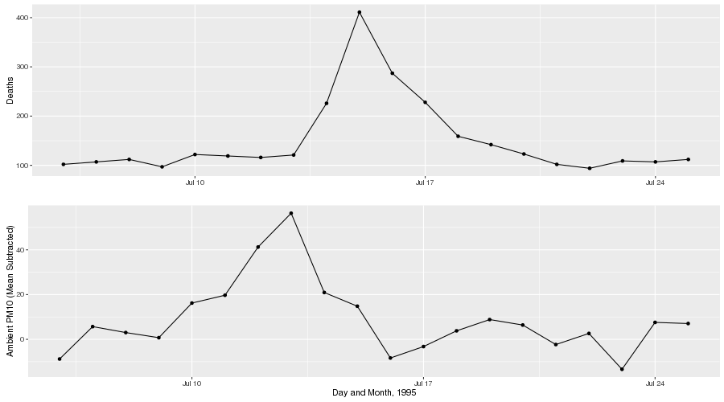
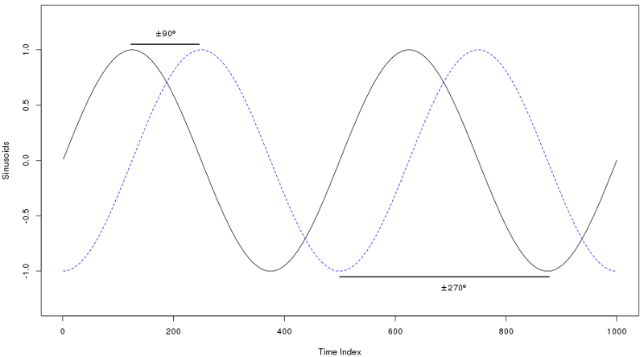
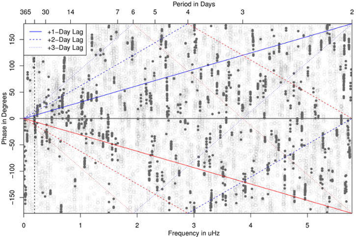
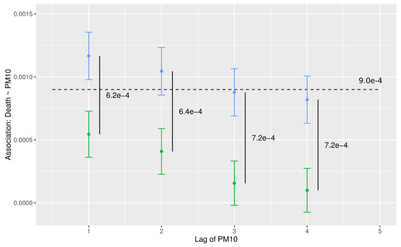

## The Problem
<center>


--- .class #id

## Mechanism

- Ambient exposure triggers physiological symptoms
 - Morbidity (hospitalizations, health conditions) and Mortality (premature death due to physiological causes)
- Not just extreme events: there appears to be no "safe" lower limit
- Air pollution $\longrightarrow$ public health

--- .class #id

## General form of single-lag model

The traditional approach in the field uses a log-linear Generalized
Additive Model to obtain the estimated pollution log-relative-rate $\beta$ for
pollutant $\mathbf{x}$, 

$$\begin{split}
\log (\mu) &= \beta \mathbf{x} + \gamma_1 \text{DOW} + S_1 (\text{time},7/\text{year}) \\
&+ S_2(\text{temp},3) + \cdots \\
\end{split}
$$
with various confounding terms such as temperature (mean daily), day-of-week (DOW, as factor), 
and time. In R using the gam package, we might estimate such a model via
```{r, eval = FALSE}
mod <- gam(y ~ x + dow + ns(time, df = 7) + ns(temp, df = 3), family = poisson, 
           data = my_data)
```

--- .class

## However ...

<par><center>
### Is there any reason for the predictor and response to be associated at precisely one integer lag?

--- .class #id

## Distributed Lag

A second common approach to modeling the population health impacts of air pollution
uses **distributed-lag** or **distributed-lag non-linear** models 
to estimate association over multiple lags. 

Simple distributed lag model:
$$
y_t = a + w_o x_t + w_1 x_{t-1} + \cdots + w_n x_{t-n} + \epsilon_t.
$$

--- .class #id

## Constraints

- The approach is coarse (resolution of one day at best)
(due to health data recording constraints)
- Multicollinearity essentially forces the placing of structure upon the lags

--- .class

## Some time series review

Given a time series $x_t$, indexed by time:
- Take the Fourier transform $S_x(f)$, a complex function of frequency, then ...
- the complex amplitude of this is the **spectrum** (**spectral density**)
- the complex argument is the **phase**

Given two series $x_t, y_t$, we can also estimate the **cross-spectral density**,
which again has two components: the amplitude (spectrum) and phase. 

<par><center>
Remember: the spectrum is a **sinusoidal** decomposition of power.

--- .class

## Example of sinusoid phase

<center>


--- .class

## Toronto, Ontario: 1984-2012

<center>


--- .class

## Synthetic lag

A large portion of the association obtained by the fitting of the residual effective
predictor and response, after accounting for other confounders and the smooth function
of time, is actually driven by ***coherence between short timescale line components***
present in both the predictor and response.

<par><center>
This opens the door to a different formulation.

--- .class

## Synthetic lag, continued

Instead of considering the association as point regression on discrete, day-sized chunks of
data, consider a continuous relationship between the predictor (health effect) and 
response (air pollutant). The data consists of:

- Daily counts of health effect occurrences (mortality, hospitalization, etc.)
- Daily metric of air pollution to match (24-hour mean, maximum 8-hour average, etc.)

--- .class

## Algorithm framework

- Estimate MTM spectra for both predictor and response
- Estimate coherence between the two; identify periodic structure relationships
- Estimate phase 
- Align the phase of the individual periodicities in the predictor to the phase of the response
- Invert phase-aligned pollutant spectra back to time domain

--- .class

## Associations: Chicago (1987-2000), NMMAPS

<center>



--- .class

## Conclusion and Questions

- Philosophical question on net association
- Should only "structural" relationships be mapped?
- Which lag is most appropriate as starting point?
- Is there an optimal alignment procedure?

--- .class

## Thanks to ...
- Johns Hopkins and the NMMAPS team
- Health Canada
- Environment Canada

for access to wonderful data.


